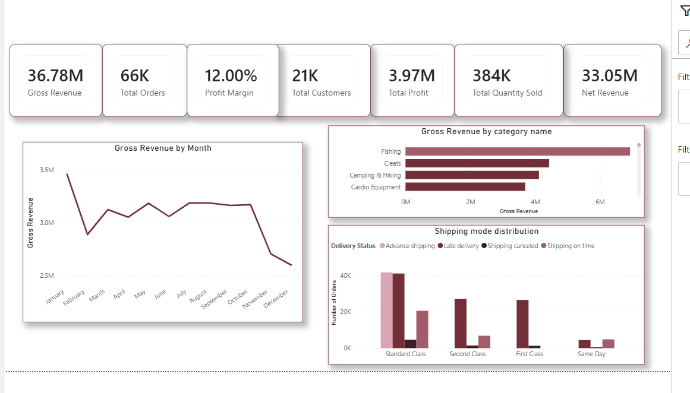
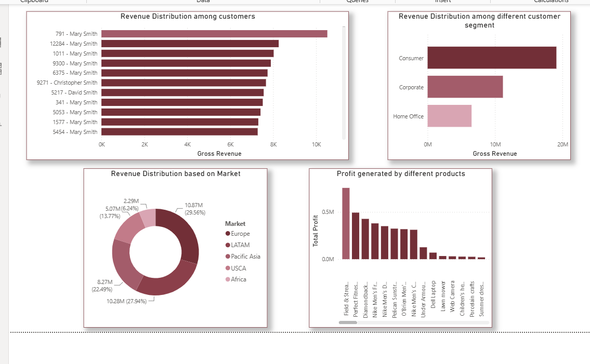

# 📦 Supply Chain Analytics Dashboard

An interactive **Supply Chain Analytics Dashboard** built using **PostgreSQL, SQL, Power BI, and DAX** to analyze sales performance, customer behavior, product profitability, and shipping operations through interactive business dashboards.

---

# 📌 Project Overview

This project focuses on transforming raw supply chain data into meaningful business insights using SQL for data analysis and Power BI for interactive visualization.

The dashboard enables stakeholders to monitor key business KPIs, identify high-performing products, understand customer segments, evaluate shipping performance, and support data-driven decision-making.

---

# 🎯 Objectives

- Analyze overall business performance
- Track Revenue, Profit and Profit Margin
- Identify top-performing products and customers
- Analyze customer segments and market performance
- Monitor shipping efficiency and delivery status
- Build an interactive dashboard for business users

---

# 🛠 Tech Stack

- PostgreSQL
- SQL
- Power BI
- DAX

---

# 📂 Dataset

**Dataset:** DataCo Smart Supply Chain Dataset

The dataset contains information about:

- Orders
- Customers
- Products
- Shipping
- Sales
- Markets
- Categories

---

# 📊 Dashboard Preview

## Executive Dashboard



### Features

- Gross Revenue
- Net Revenue
- Total Profit
- Profit Margin
- Total Orders
- Total Customers
- Total Quantity Sold
- Monthly Revenue Trend
- Revenue by Category
- Top Revenue Generating Products
- Shipping Performance

---

## Customer & Product Insights



### Features

- Revenue Distribution among Customers
- Revenue by Customer Segment
- Revenue by Market
- Top Profit Generating Products
- Delivery Status Distribution
- Customers by Market
- Average Shipping Days by Shipping Mode

---

# 🗄 SQL Analysis

The project demonstrates practical business SQL using:

- Data Cleaning
- Aggregate Functions
- GROUP BY
- HAVING
- CASE WHEN
- Common Table Expressions (CTEs)
- Window Functions
- ROW_NUMBER()
- RANK()
- DENSE_RANK()
- LAG()
- Running Totals
- Revenue Analysis
- Customer Analytics
- Product Analytics
- Shipping Analysis

---

# 📁 Repository Structure

```text
Supply-Chain-Analytics-Dashboard
│
├── dashboard
│   └── supply_chain.pbix
│
├── images
│   ├── Executive_Dashboard.png
│   ├── Customer_Product_Insights.png
│
├── sql
│   ├── 00_project_setup.sql
│   ├── 01_data_import.sql
│   ├── 02_data_cleaning.sql
│   ├── 03_EXECUTIVE_DASHBOARD_KPIS.sql
│   ├── 04_Business_Analysis.sql
│   └── 05_ADVANCED_SQL.sql
│
├── README.md
└── LICENSE
```

---

# 💡 Key Business Insights

- Fishing generated the highest revenue among all product categories.
- Consumer customers contributed the largest share of total revenue.
- Europe generated the highest revenue among all markets.
- Standard Class handled the highest number of customer orders.
- Late deliveries represented the largest portion of all deliveries.
- Product profitability varied significantly across categories despite similar revenue levels.

---

# 🚀 Skills Demonstrated

- SQL Data Analysis
- PostgreSQL
- Power BI Dashboard Development
- DAX Measures
- Business Intelligence
- Data Visualization
- KPI Design
- Analytical Thinking

---

# 📬 Contact

**Utkarsh Yadav**

- GitHub: https://github.com/uttkarshyadavv
- LinkedIn: (https://www.linkedin.com/in/utkarsh-yadavv/)

---

⭐ If you found this project helpful, consider giving it a star.
